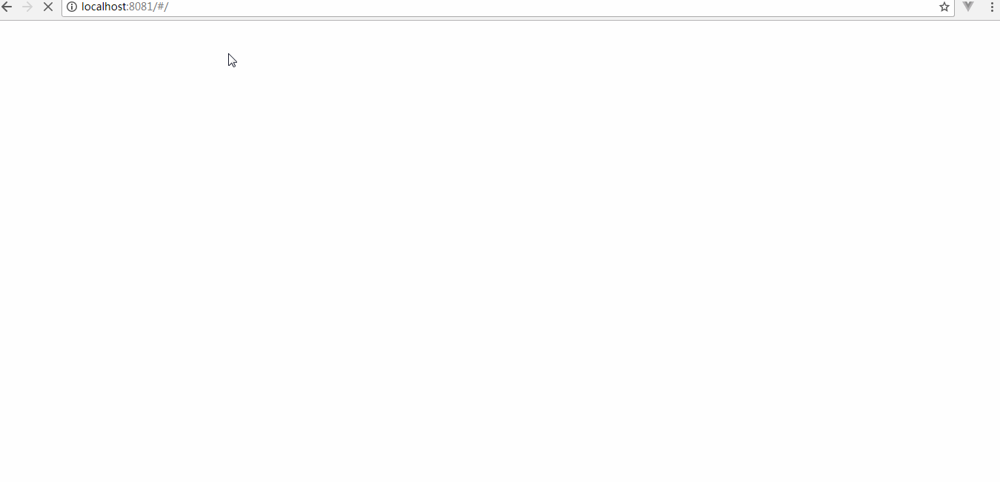

# spring-boot-tucao-weibo
这是一个使用Spring Boot实现的微博后端系统。前后台分离，后台可独立开发和调试。  
微博系统的前端使用Vue实现，[移步到前端系统](https://github.com/weieyuan/vue-demo-tucao-weibo).

##Demo
前后台运行的效果：  

## 技术栈
Spring Boot  
Spring Data JPA  
Stomp(WebSocket)
